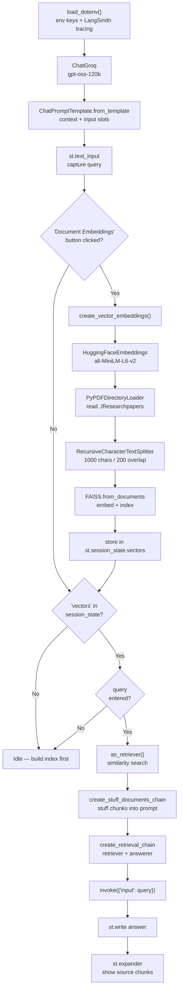
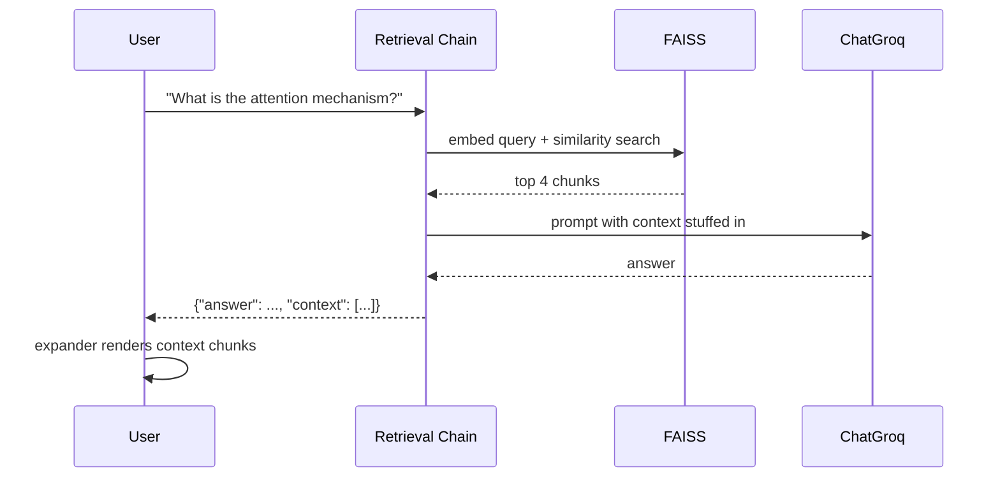

# Groq Research Paper Q&A — Flow & Node Reference

A Streamlit RAG app over a **local folder** of research papers: click once to build the index, then ask questions and inspect the source chunks.

**Stack:** Streamlit (UI) · Groq (LLM) · HuggingFace (embeddings) · FAISS (vector DB) · LangChain (orchestration) · LangSmith (tracing)

> **Key difference from the PDF chatbot:** this app is **stateless** — no chat history, no session IDs. Every question is independent.

---

## 1. High-Level Flow



---

## 2. Two Distinct Phases

| Phase | Trigger | Nodes | Cost | Repeats? |
|---|---|---|---|---|
| **Indexing** | Button click (once) | Load → Split → Embed → FAISS | Expensive | No — guarded by `session_state` |
| **Query** | Each question | Retrieve → Stuff → Answer | Cheap | Yes |

The `if "vectors" not in st.session_state` guard is what makes this app **much cheaper than the chatbot version**, which re-embeds on every rerun.

---

## 3. Node-by-Node Reference

### Setup Nodes

| Node | Short description |
|---|---|
| `load_dotenv()` | Loads `.env` so `GROQ_API_KEY` and `LANGCHAIN_API_KEY` aren't hardcoded. |
| `LANGCHAIN_PROJECT` / `TRACING_V2` | Routes every chain run to the `GROQ_QA_CHATBOT` project in LangSmith. |
| `ChatGroq` | The answering LLM. Called **once per question** (no query-rewrite step here). |
| `ChatPromptTemplate.from_template` | A **single-string** template (not a message list). Rules: answer *only* from context, be accurate. The `<context>` XML tags help the model see where evidence starts and ends. |

### Indexing Nodes — `create_vector_embeddings()`

| Node | Short description |
|---|---|
| `if "vectors" not in st.session_state` | The idempotency guard. Runs the expensive block exactly once per Streamlit session. |
| `HuggingFaceEmbeddings` | Loads `all-MiniLM-L6-v2` locally → 384-dim vectors. No API cost, runs on your CPU. |
| `PyPDFDirectoryLoader("Researchpapers")` | Reads **every PDF in the folder** and returns one `Document` per page, with `source` + `page` metadata. |
| `RecursiveCharacterTextSplitter` | Cuts pages into ~1000-char chunks with 200-char overlap. Splits on paragraph → line → word → char, so sentences aren't severed. Overlap keeps facts spanning a boundary retrievable. |
| `FAISS.from_documents` | Embeds every chunk and builds an **in-memory** FAISS index (flat L2 by default). Fast exact search for small corpora. |
| `st.session_state.vectors = ...` | Persists the index across Streamlit reruns. This is the whole point of the guard. |

### Query Nodes

| Node | Short description |
|---|---|
| `st.text_input` | Captures the question. Submitting reruns the entire script top-to-bottom. |
| `as_retriever()` | Wraps FAISS in a search interface: query → top-k (default 4) nearest chunks. |
| `create_stuff_documents_chain` | "Stuff" = concatenate all retrieved chunks into `{context}` in one prompt, then one LLM call. Simplest strategy; fails only if chunks exceed the context window. |
| `create_retrieval_chain` | Glues retriever + answerer. Input `{"input": ...}` → output `{"input", "context", "answer"}`. |
| `.invoke({"input": user_prompt})` | Runs the chain. Note: **no `config`/`session_id`** — this chain has no memory. |
| `response["answer"]` | The generated answer string. |
| `st.expander` + `response["context"]` | Renders the exact chunks the LLM saw. This is the app's best feature — it makes answers **verifiable**, not just plausible. |

---

## 4. What Happens on One Question



**One LLM call per question.** Compare to the history-aware chatbot, which makes two (rewrite + answer).

---

## 5. Prompt Anatomy

```python
ChatPromptTemplate.from_template("""
    Answer the questions based only on the provided context.
    <context>
    {context}
    </context>
    Question: {input}
""")
```

| Slot | Type | Filled by |
|---|---|---|
| `{context}` | `str` | `create_stuff_documents_chain` — joins the retrieved chunks |
| `{input}` | `str` | You, via `.invoke()` |

`from_template` produces a **single Human message**. Contrast with `from_messages([...])`, which builds a multi-role list and is required if you ever add `MessagesPlaceholder("chat_history")`.

---

## 6. Debugging Cheatsheet

| Symptom | Likely cause | Check |
|---|---|---|
| Nothing happens on query | Index not built | Click **Document Embeddings** first; verify `"vectors" in st.session_state` |
| Empty / zero documents | Folder missing or has no PDFs | `print(len(st.session_state.documents))` |
| Answer ignores a paper you added | Guard blocks rebuild | Index is stale — see Limitation #1 |
| Wrong or vague answers | Retrieval missed | Open the expander — are the chunks actually relevant? |
| `TypeError: str expected, not NoneType` | `LANGCHAIN_API_KEY` unset | See Limitation #3 |
| Response time looks ~0.0s | `process_time()` ignores I/O wait | See Limitation #4 |
| Nothing in LangSmith | Key or flag missing | `LANGCHAIN_API_KEY` + `LANGCHAIN_TRACING_V2` |

Inspect what the LLM actually received:

```python
print(prompt.input_variables)                  # ['context', 'input']
print(len(response["context"]), "chunks")
for d in response["context"]:
    print(d.metadata.get("source"), d.metadata.get("page"))
```

---

## 7. Known Issues & Fixes

| # | Issue | Impact | Fix |
|---|---|---|---|
| 1 | **Index can never be rebuilt** | The guard means adding new PDFs does nothing until the app restarts | Add a "Rebuild" button that runs `st.session_state.pop("vectors", None)` first |
| 2 | **`st.markdown(st.write(x))`** | `st.write` returns `None`, so this is really `st.markdown(None)` — a no-op wrapping a side effect | Just call `st.write(x)` (appears 2×) |
| 3 | **`os.environ[...] = os.getenv(...)`** | `TypeError` at startup if the var is unset | `os.getenv("LANGCHAIN_API_KEY", "")` |
| 4 | **`time.process_time()`** | Measures CPU time, not wall-clock — an LLM call spent waiting on the network reads as ~0s | Use `time.perf_counter()` |
| 5 | **Timing goes to `print()`** | Invisible in the browser, only in the terminal | `st.caption(f"Response time: {elapsed:.2f}s")` |
| 6 | **`import time` mid-file** | Works, but violates PEP 8 | Move to the top with the other imports |
| 7 | **In-memory FAISS** | Index dies on restart; full re-embed every launch | `vectors.save_local("faiss_index")` + `FAISS.load_local(...)` |
| 8 | **Loader/splitter/docs in `session_state`** | Keeps the full document list in memory for no reason | Use local variables; only `vectors` needs to persist |
| 9 | **No chat history** | Follow-ups like *"explain that further"* fail — each query is isolated | Add `create_history_aware_retriever` + `RunnableWithMessageHistory` |
| 10 | **No guard on missing folder** | Cryptic error if `Researchpapers/` is absent or empty | Check `os.path.isdir(...)` and `st.error(...)` early |
| 11 | **No source labels in expander** | Chunks shown without saying which paper/page | Also render `doc.metadata["source"]` and `["page"]` |

---

## 8. Comparison With the Conversational PDF Chatbot

| Aspect | This app (Research Q&A) | PDF Chatbot |
|---|---|---|
| Document source | Local folder (`PyPDFDirectoryLoader`) | User upload (`st.file_uploader`) |
| Vector store | FAISS | Chroma |
| Memory | None — stateless | `RunnableWithMessageHistory` per session |
| LLM calls / question | 1 | 2 (rewrite + answer) |
| Indexing trigger | Manual button, cached | Automatic, **re-runs every time** |
| Shows sources | Yes (expander) | No |
| Follow-up questions | Not supported | Supported |
| Best for | Fixed reference corpus | Ad-hoc document conversations |

**Each has the other's strength:** this app caches correctly and cites sources; the chatbot handles conversation. The ideal version combines both.

---

## 9. Mental Model

> **Click the button once** → every PDF in the folder becomes a searchable FAISS index held in `session_state`.
> **Ask a question** → nearest chunks are fetched, stuffed into one prompt, answered in a single LLM call.
> **Open the expander** → see the exact evidence, so you can trust or reject the answer.
> **No memory** → every question stands alone.
