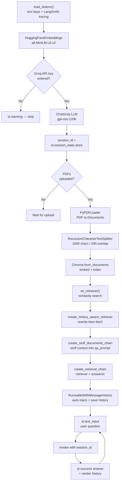
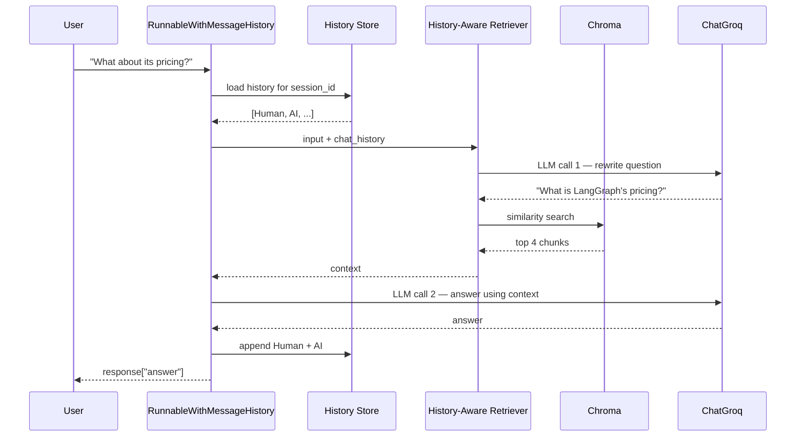

# Conversational PDF Chatbot — Flow & Node Reference

A Streamlit RAG app: upload PDFs → ask questions → get answers that remember the conversation.

**Stack:** Streamlit (UI) · Groq (LLM) · HuggingFace (embeddings) · Chroma (vector DB) · LangChain (orchestration) · LangSmith (tracing)

---

## 1. High-Level Flow



---

## 2. Two Distinct Phases

| Phase | Runs when | Nodes | Cost |
|---|---|---|---|
| **Ingestion** | PDFs uploaded (rebuilt on every rerun) | Load → Split → Embed → Index | Expensive |
| **Query** | Each question asked | Rewrite → Retrieve → Stuff → Answer → Save | Cheap |

---

## 3. Node-by-Node Reference

### Setup Nodes

| Node | Short description |
|---|---|
| `load_dotenv()` | Loads `.env` into the process so API keys aren't hardcoded. |
| `LANGCHAIN_TRACING_V2 = "true"` | Turns on LangSmith tracing — every chain step becomes visible in the dashboard. |
| `HuggingFaceEmbeddings` | Loads `all-MiniLM-L6-v2` locally. Converts text → 384-dim vectors. Runs on your machine, no API cost. |
| `st.text_input(type="password")` | Collects the Groq key at runtime instead of storing it. Everything below is gated on this. |
| `ChatGroq` | The LLM. Used **twice** per question: once to rewrite the question, once to answer it. |
| `session_id` | Names the conversation. Change it → fresh chat. Reuse it → continued chat. |
| `st.session_state.store` | A `dict` of `session_id → ChatMessageHistory`. Survives Streamlit reruns; lost on server restart. |

### Ingestion Nodes

| Node | Short description |
|---|---|
| `st.file_uploader` | Accepts multiple PDFs as in-memory objects. |
| `PyPDFLoader` | Writes bytes to `./temp.pdf`, then parses it into one `Document` **per page**, with metadata. |
| `documents.extend(docs)` | Merges pages from all PDFs into one flat list. |
| `RecursiveCharacterTextSplitter` | Cuts documents into ~1000-char chunks with 200-char overlap. Tries paragraph → line → word → char boundaries, so meaning isn't sliced mid-sentence. The overlap prevents losing facts that straddle a chunk edge. |
| `Chroma.from_documents` | Embeds every chunk and stores vector + text + metadata in an **in-memory** index. |
| `as_retriever()` | Wraps the store in a search interface: query → top-k (default 4) most similar chunks. |

### Chain Nodes

| Node | Short description |
|---|---|
| `contextualized_q_prompt` | System + `chat_history` + `{input}`. Instructs the LLM to **rewrite, not answer**. |
| `create_history_aware_retriever` | **Rewrite → retrieve.** Turns `"What about its pricing?"` into `"What is LangGraph's pricing?"`, then searches with that standalone query. Smart shortcut: if `chat_history` is empty, it skips the rewrite LLM call and searches directly. |
| `qa_prompt` | System (with `{context}` slot) + `chat_history` + `{input}`. Instructs: answer from context only, say "I don't know" otherwise, max 3 sentences. |
| `create_stuff_documents_chain` | "Stuff" = concatenate all retrieved chunks into the `{context}` slot in one prompt, then call the LLM. Simplest strategy — fine until chunks exceed the context window. |
| `create_retrieval_chain` | Glues the two together. Input `{"input": ...}` → output `{"input", "chat_history", "context", "answer"}`. Note `context` is returned, which is what makes citations possible. |
| `get_session_history` | Lazy factory: returns the history for a `session_id`, creating an empty one on first use. |
| `RunnableWithMessageHistory` | The memory wrapper. **Before** the call it injects saved history into `chat_history`; **after** it appends the new question and answer. The three keys tell it where to read input, where to inject history, and which output field to persist. |

### Runtime Nodes

| Node | Short description |
|---|---|
| `st.text_input("Ask a question")` | Captures the question. Streamlit reruns the whole script on submit. |
| `.invoke(..., config={"configurable": {"session_id": ...}})` | Executes the chain. `session_id` **must** go in `config`, not in the input dict. |
| `st.success(response["answer"])` | Renders the answer. |
| `st.write(session_history.messages)` | Dumps raw `HumanMessage` / `AIMessage` objects — your primary debugging window. |

---

## 4. What Happens on One Question



**Two LLM calls per question** (one if history is empty). Worth knowing for cost and latency.

---

## 5. Prompt Anatomy

Both prompts share the same three-part shape:

```python
[
    ("system", instructions),          # fixed role + rules
    MessagesPlaceholder("chat_history"),  # 0..N messages, injected automatically
    ("human", "{input}"),              # exactly 1 message, the current question
]
```

| Slot | Type | Count | Filled by |
|---|---|---|---|
| `{input}` | `str` | always 1 | You, via `.invoke()` |
| `chat_history` | `list[BaseMessage]` | 0 to N | `RunnableWithMessageHistory` |
| `{context}` | `str` | 1 (qa_prompt only) | `create_stuff_documents_chain` |

`MessagesPlaceholder` expands into a variable-length block; `{input}` is a single fill-in-the-blank. That difference is why history can grow without changing the template.

---

## 6. Debugging Cheatsheet

| Symptom | Likely cause | Check |
|---|---|---|
| "I don't know" every time | Retrieval missed | `print(response["context"])` — are the chunks relevant? |
| Follow-ups ignore history | History not injected | `st.write(session_history.messages)` — is it populated? |
| `KeyError: 'chat_history'` | Prompt key ≠ `history_messages_key` | Both must be `"chat_history"` |
| Re-embeds on every keystroke | No caching (see below) | Expected with this code |
| Answers leak between users | Shared `session_id` | Give each user a unique ID |
| Nothing in LangSmith | Key or flag missing | `LANGCHAIN_API_KEY` + `LANGCHAIN_TRACING_V2` |

Inspect the real prompt sent to the LLM:

```python
print(qa_prompt.input_variables)
for m in qa_prompt.format_messages(chat_history=[], input="test", context="ctx"):
    print(type(m).__name__, "|", m.content[:120])
```

---

## 7. Known Limitations

| # | Issue | Impact | Fix |
|---|---|---|---|
| 1 | **Re-ingests on every rerun** | PDFs are re-parsed and re-embedded on each interaction — slow and wasteful | Wrap ingestion in `@st.cache_resource` keyed on file hash |
| 2 | **Fixed `./temp.pdf`** | Concurrent users overwrite each other's file | Use `tempfile.NamedTemporaryFile()` and delete after load |
| 3 | **In-memory Chroma** | Index dies on restart | Pass `persist_directory=...` |
| 4 | **History grows unbounded** | Token cost climbs; eventually overflows context | Trim to last N turns or summarize |
| 5 | **Temp file never deleted** | Leftover files on disk | `finally: os.remove(path)` |
| 6 | **No source citations** | User can't verify answers | `response["context"]` already holds the chunks — render their metadata |

---

## 8. Mental Model

> **Ingestion** turns PDFs into a searchable vector index.
> **History-aware retrieval** makes a vague follow-up self-contained *before* searching.
> **Stuffing** pastes the retrieved chunks into the answer prompt.
> **`RunnableWithMessageHistory`** silently loads history before and saves it after — so the chain itself stays stateless.
