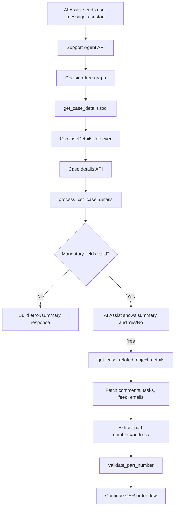

```mermaid
flowchart TD
    A[AI Assist sends user message: csr start] --> B[Support Agent API]
    B --> C[Decision-tree graph]
    C --> D[get_case_details tool]
    D --> E[CsrCaseDetailsRetriever]
    E --> F[Case details API]
    F --> G[process_csr_case_details]
    G --> H{Mandatory fields valid?}
    H -->|No| I[Build error/summary response]
    H -->|Yes| J[AI Assist shows summary and Yes/No]
    J -->|Yes| K[get_case_related_object_details]
    K --> L[Fetch comments, tasks, feed, emails]
    L --> M[Extract part numbers/address]
    M --> N[validate_part_number]
    N --> O[Continue CSR order flow]
```